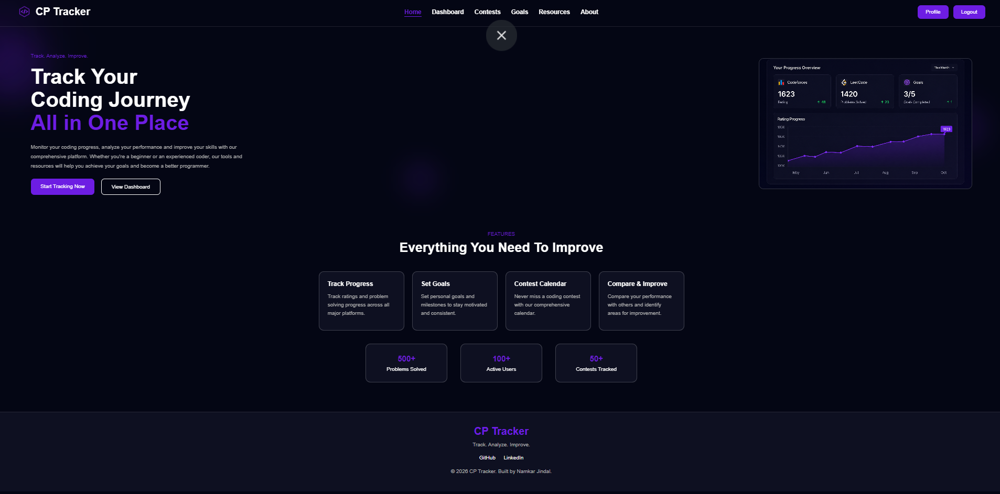
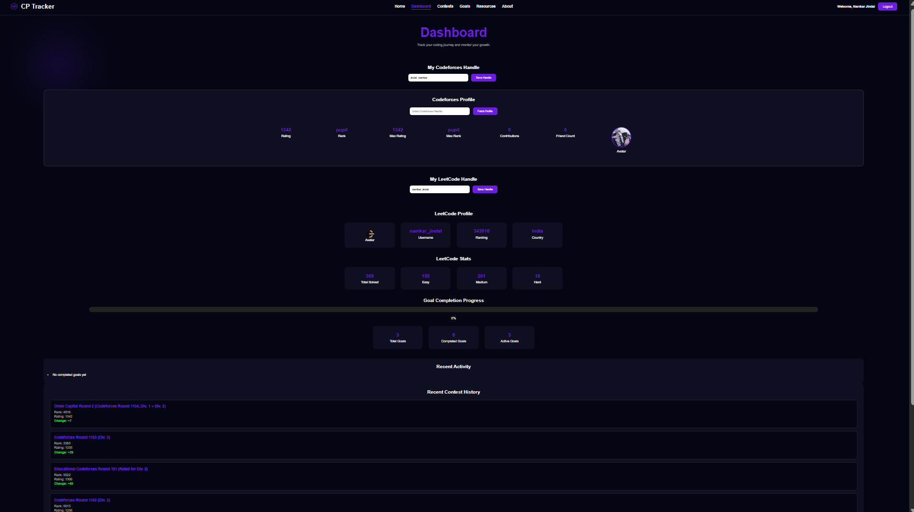
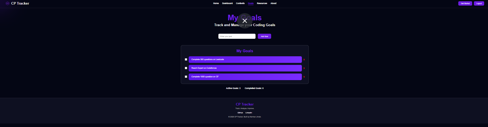
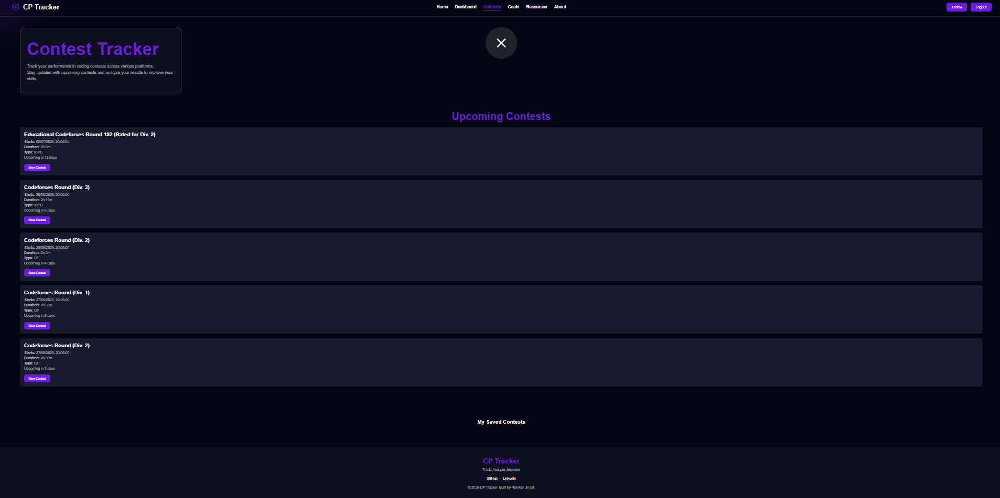
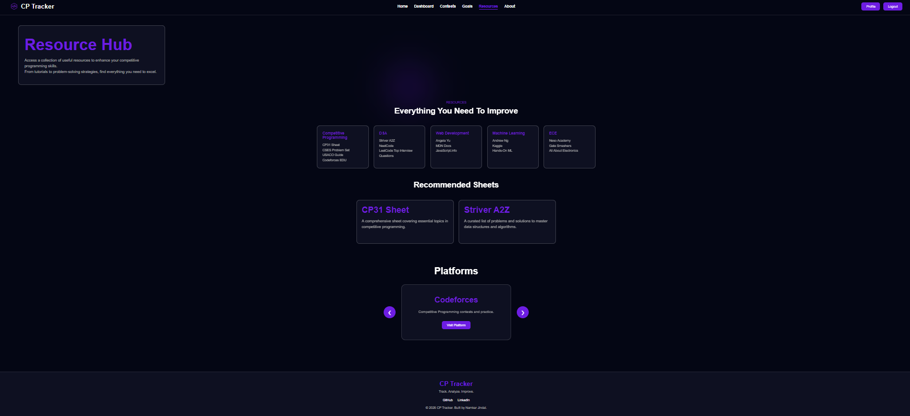

# 🚀 CP Tracker

CP Tracker is a full-stack web application built for competitive programmers to track their coding journey, manage goals, save contests, and monitor progress across platforms like Codeforces and LeetCode.

---

## ✨ Features

### 🔐 Authentication
- User Signup & Login
- Secure password hashing using bcrypt
- Session-based authentication
- Password validation
- Email format validation

### 📊 Dashboard
- Codeforces Profile Integration
- LeetCode Profile Integration
- Goal Completion Progress
- Recent Activity
- Recent Contest History
- Saved Contest Display

### 🎯 Goal Management
- Add Goals
- Complete Goals
- Delete Goals
- Progress Tracking

### 🏆 Contest Tracker
- View Upcoming Contests
- Save Contests
- Remove Saved Contests
- Contest History Tracking

### 👤 Profile Management
- View User Information
- Edit Username
- Edit Email
- Track Goals & Contest Statistics

### 🎨 UI Features
- Fully Responsive Design
- Mouse Glow Effect
- Counter Animations
- Card Hover Effects
- Active Navbar Highlighting
- Modern Dark Theme

---

## 🛠️ Tech Stack

### Frontend
- HTML5
- CSS3
- JavaScript

### Backend
- Node.js
- Express.js

### Database
- PostgreSQL

### Authentication & Security
- bcrypt
- express-session
- dotenv

### APIs
- Codeforces API
- LeetCode API

---

## 📂 Project Structure

```text
CP-Tracker/
│
├── Assets/
├── CSS/
├── Js/
├── Pages/
│
├── app.js
├── db.js
├── package.json
├── README.md
└── .gitignore
```

---

## ⚙️ Installation

### Clone Repository

```bash
git clone https://github.com/Namkar255/CP-Tracker.git

cd CP-Tracker
```

### Install Dependencies

```bash
npm install
```

### Create .env File

```env
DB_USER=postgres
DB_HOST=localhost
DB_NAME=cp_tracker
DB_PASSWORD=your_password
DB_PORT=5432
```

### Run Application

```bash
npm start
```

or

```bash
nodemon app.js
```

Open:

```text
http://localhost:3000
```

---

## 📸 Screenshots

### Home Page



### Dashboard



### Goals Page



### Contests Page



### Resources Page


## 🚀 Future Improvements

- Email Verification
- Password Reset System
- Contest Reminder Notifications
- Data Visualization Charts
- Advanced Analytics
- Deployment

---

## 👨‍💻 Author

**Namkar Jindal**

GitHub:
https://github.com/Namkar255

LinkedIn:
https://www.linkedin.com/in/namkar-jindal-0879343a8/

---

## ⭐ Support

If you like this project, consider giving it a star on GitHub!